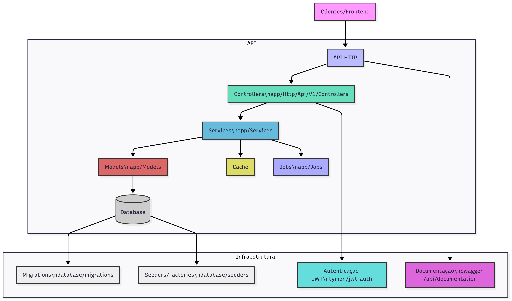

# 📚 Sistema de Gerenciamento de Biblioteca

Este é um sistema completo para gerenciamento de usuários, livros, gêneros e empréstimos de uma biblioteca, desenvolvido em Laravel.

---

## 🚀 Tecnologias Utilizadas

### Backend
- **PHP 8.2+**
- **Laravel 12**
- **MySQL**
- **JWT Auth** (`tymon/jwt-auth`)
- **L5-Swagger** (documentação de API)
- **Cache**: Api cache laravel
- **Laravel Debugbar** (dev)

### Frontend
- **React** 
- **Axios**

---

## ⚙️ Como rodar o projeto

### Pré-requisitos
- PHP 8.2+
- Composer
- MySQL
- Node.js e npm (opcional, para frontend)
- Redis (opcional, para cache)

### Instalação Backend (Laravel)

1. **Clone o repositório:**
   ```bash
   git clone https://github.com/seu-usuario/nome-do-repo.git
   cd nome-do-repo
   ```
2. **Instale as dependências:**
   ```bash
   composer install
   ```
3. **Copie o arquivo de ambiente:**
   ```bash
   cp .env.example .env
   ```
4. **Configure o banco de dados** no `.env`:
   ```env
   DB_CONNECTION=mysql
   DB_HOST=127.0.0.1
   DB_PORT=3306
   DB_DATABASE=nome_do_banco
   DB_USERNAME=usuario
   DB_PASSWORD=senha
   ```
5. **Gere a chave da aplicação:**
   ```bash
   php artisan key:generate
   ```
6. **Rode as migrations e seeders:**
   ```bash
   php artisan migrate --seed
   ```
   - Para resetar o banco e popular novamente:
     ```bash
     php artisan migrate:fresh --seed
     ```
7. **(Opcional) Configure o cache para Redis:**
   No `.env`:
   ```env
   CACHE_STORE=redis
   REDIS_HOST=127.0.0.1
   REDIS_PORT=6379
   ```
8. **Gere o JWT secret:**
   ```bash
   php artisan jwt:secret
   ```
9. **Inicie o servidor:**
   ```bash
   php artisan serve
   ```

### Instalação Frontend (opcional)

1. **Instale as dependências:**
   ```bash
   npm install
   ```
2. **Inicie o servidor de desenvolvimento:**
   ```bash
   npm run dev
   ```

---

## 🔐 Autenticação
- A autenticação é feita via JWT (Bearer Token).
- Após o login, inclua o token no header das requisições:
  ```
  Authorization: Bearer {seu_token}
  ```

### Exemplo de login
Endpoint: `POST /api/login`
Payload:
```json
{
  "email": "admin@gmail.com",
  "password": "Admin1234!"
}
```
Resposta:
```json
{
  "token": "eyJ0eXAiOiJKV1QiLCJhbGciOiJIUzI1NiJ9..."
}
```

### Exemplo de requisição autenticada
Inclua o token JWT no header das requisições protegidas:
```
Authorization: Bearer seu_token_aqui
```

---

## 🧾 Documentação da API
- Acesse a documentação Swagger em: `http://localhost:8000/api/documentation`
- Todos os endpoints estão documentados com exemplos de request/response.
- Para gerar/atualizar a documentação Swagger, rode:
  ```bash
  php artisan l5-swagger:generate
  ```
- Se necessário, publique o config do Swagger:
  ```bash
  php artisan vendor:publish --provider="L5Swagger\L5SwaggerServiceProvider"
  ```

---

## 🗄️ Cache
- Listagens de livros, usuários, gêneros e empréstimos utilizam cache automático por página.
- O cache é invalidado ao criar, atualizar ou deletar registros.
- Suporte a Redis ou Database.

---

## 🏛️ Arquitetura do Projeto



O sistema segue uma arquitetura em camadas, separando responsabilidades para facilitar manutenção, testes e escalabilidade:

- **Controllers:** Responsáveis por receber as requisições HTTP, validar dados e repassar para os serviços. Ficam em `app/Http/Api/V1/Controllers`.
- **Services:** Contêm a lógica de negócio principal (ex: criação de empréstimos, regras de cache, validações customizadas). Ficam em `app/Services`.
- **Models:** Representam as entidades do banco de dados e suas relações. Ficam em `app/Models`.
- **Migrations:** Definem a estrutura das tabelas do banco de dados. Ficam em `database/migrations`.
- **Seeders e Factories:** Geram dados de teste e populam o banco. Ficam em `database/seeders` e `database/factories`.
- **Jobs:** Processos assíncronos e agendados, como verificação de empréstimos vencidos. Ficam em `app/Jobs`.
- **Cache:** Implementado nas listagens de entidades, usando api cache do laravel, para melhorar performance.
- **Autenticação:** Utiliza JWT (via `tymon/jwt-auth`) para autenticação de API.
- **Versionamento de API:** Todas as rotas da API estão sob o prefixo `/api/V1/`, facilitando futuras evoluções sem quebrar clientes existentes.
- **Documentação:** Todos os endpoints são documentados via Swagger (L5-Swagger), acessível via `/api/documentation`.

Essa separação garante um código limpo, organizado e fácil de evoluir.

---

## 🛠️ Comandos Úteis
- Rodar testes:
  ```bash
  php artisan test
  ```
- Limpar cache:
  ```bash
  php artisan cache:clear
  ```
- Rodar jobs agendados:
  ```bash
  php artisan schedule:work
  ```

---

## 🧪 Testes de Integração
- Os testes cobrem:
  - Login e autenticação JWT
  - Criação de livros autenticada
  - Paginação de usuários
- Para rodar todos os testes:
  ```bash
  php artisan test
  ```
- Certifique-se de que as factories estejam atualizadas para campos obrigatórios (ex: `registration_number` em User).

---

## 👤 Credenciais de Teste
- Você pode criar usuários via endpoint de cadastro ou seeders.
- Exemplo de login:
  ```json
  {
    "email": "admin@gmail.com",
    "password": "Admin1234!"
  }
  ```

---

## 📄 Licença
MIT
